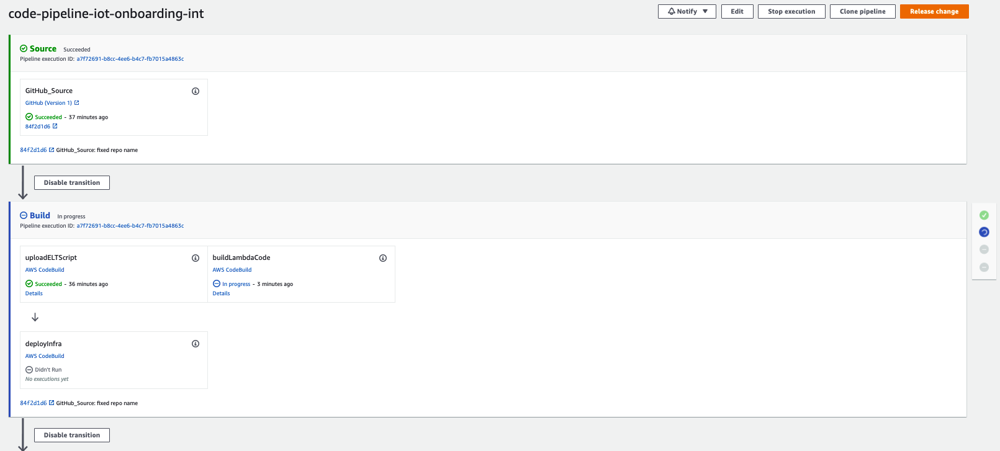
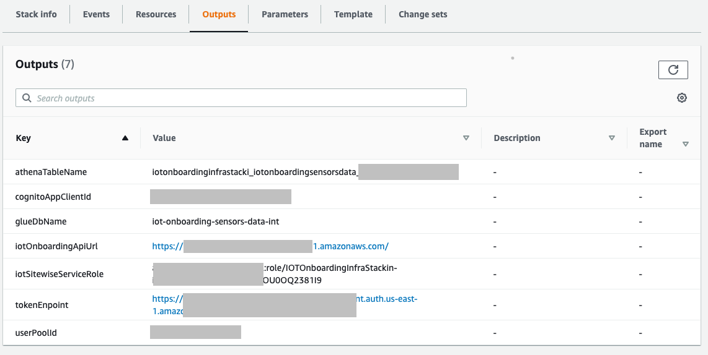
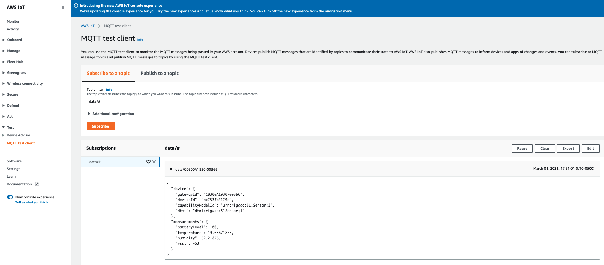

// Add steps as necessary for accessing the software, post-configuration, and testing. Don’t include full usage instructions for your software, but add links to your product documentation for that information.
//Should any sections not be applicable, remove them

=== View the CDK deployment using AWS CodePipeline
 
Once the AWS CloudFormation template has deployed successfully, open AWS CodePipeline to see the pipeline running.

[#codePipeline1]
.AWS CodePipeline console
image::../images/quickstart-cicd-3.png[CodePipeline]

If you choose the pipeline name, you can see the steps of the pipeline running:
[#codePipeline2]
.AWS CodePipeline console


After the pipeline has deployed the CDK code, open the CloudFormation console, choose the template (it will be named something similar to *IOTOnboardingInfraStackint*), and then choose *Outputs* to view the created resources.
[#codePipeline3]
.Outputs after pipeline CDK deployment



== Connecting devices
=== Rigado devices
If you are using Rigado devices using the http://rigado.com/knowledge-base/introduction-to-the-rigado-allegro-kit[Rigado Allegro Kit], go to the Rigado wizard and enter the data that you received from the Quick Start script. The email that you received after the devices were activated provides further instructions.
```
AWS IOT Connectivity QuickStart Output Values


--------------------------------------------------------------------------------------------
| Cognito URL | https://iot-onboarding-quickstart-<env>.auth.us-east-1.amazoncognito.com/oauth2/token
--------------------------------------------------------------------------------------------
| API Gateway URL | https://<api_id>.execute-api.us-east-1.amazonaws.com/
--------------------------------------------------------------------------------------------
| Client ID | 228v...t9c3
--------------------------------------------------------------------------------------------
| Refresh Token | eyJjdHkiOiJKV1QiLCJl...slN29FrDNqHWo_0e5U85ow
```
After the wizard finishes, the Rigado gateway is configured to send traffic automatically and securely to AWS IoT Core using MQTT.

NOTE: The build script creates a new Amazon Cognito user each time it runs. If you are using the pipeline to manage your own CICD process, you should clean up the list of users in your Amazon Cognito user pool to avoid unnecessary charges. Only one active user is required to access the API Gateway to onboard devices.

=== Non-Rigado devices
For non-Rigado devices (or devices not supported by the Rigado Allegro Kit), manually configure your device to allow it to communicate with AWS IoT Core. The Lambda function deployed by the Quick Start lets you generate the device certificate and key pair that's used for the help secure communication between the device and AWS IoT Core. The function also creates the IoT Thing and appropriate policy, and it returns:

* The MQTT endpoint of the AWS IoT Core broker.
* The certificate generated during the service call.
* The key pair (public and private key) generated during the service call.
* Other information about the device.

The following example is an exchange with the onboarding service. First, the session token is obtained using the client ID and the refresh token.
```
--header 'Content-Type: application/x-www-form-urlencoded'
{
    "id_token": "<id_token>",
    "access_token": "<access_token>",
    "expires_in": 3600,
    "token_type": "Bearer"
}
```
Next is a call to the onboarding service to create the device.

```
curl --location --request POST '<api_gateway_url>/api/onboard/<device_serial_number> \
--header 'Authorization: Bearer <access_token>'
{
    "serialNumber": "<device_serial_number> ",
    "deviceName": "<device_serial_number> ",
    "thingId": "<iot_thing_id>",
    "credential": {
        "certificateId": "<certificate_id>",
        "certificatePem": "<certificate data>",
        "privateKey": "<private key data>",
        "publicKey": "<public key data>"
    },
    "mqttEndpoint": "https://data.iot.<region>.amazonaws.com",
    "error": {
        "code": "",
        "msg": "",
        "type": ""
    }
}
```

The response contains the required certificates and keys for configuring the device. For information about configuring IoT devices to communicate with AWS, see https://docs.aws.amazon.com/iot/latest/developerguide/connect-to-iot.html[Connecting to AWS IoT Core].

== Checking connectivity

To validate that traffic flows correctly, go to the AWS IoT Core console and subscribe to the MQTT topic that's provided in the CloudFormation template (by default, data/# for Rigado). As long as at least one sensor is turned on, you should see messages flowing, as shown below.
[#iotCodeMqttTest]
.Testing device connectivity on AWS IoT Core


After you have validated that traffic is flowing, now you are ready to visualize the data (Rigado Allegro Kit users only).

== Visualizing the data (Rigado Allegro Kit users only)

As described in the link:#_architecture[Architecture] section above, the data sent to the AWS IoT Core MQTT broker is ingested by an IoT data lake for a posterior visualization and by AWS IoT SiteWise for live monitoring. 

=== Visualizing the data using Amazon QuickSight
To speed up your IoT project, this Quick Start deploys a predefined dashboard within Amazon QuickSight. To benefit from this feature, you need the following:

* An Amazon QuickSight Enterprise customer.
* Use of the Rigado Allegro Kit for your devices.

While the AWS Glue ETL service that ingests and processes the data is not device-agnostic, the dashboard makes assumptions about the names of the fields received and therefore works only for Rigado Allegro Kit users. By default, the data is processed by a scheduled glue crawler and ETL service every 24 hours. This default value helps minimize the cost of running the IoT data lake and can be updated easily by changing a cron expression in the AWS CDK script or directly from the AWS Glue console. The Quick Start also creates a glue trigger that can start the data refresh on demand directly from the AWS Glue console.

When accessing the Amazon QuickSight dashboard for the first time, you must provide access to the Amazon S3 bucket that contains the refined data (the data processed by the ETL script). For instructions on giving Amazon QuickSight access to the Amazon S3 bucket, see https://docs.aws.amazon.com/quicksight/latest/user/troubleshoot-connect-athena.html[I Can't Connect to Amazon Athena]. After deploying the Quick Start, you should see an analysis called *Rigado Quick Start Dashboard* in your Amazon QuickSight account, as shown below.
[#quickSightAnalysis]
.Newly created Analysis in Amazon QuickSight
image::../images/rigado-dahsboard.png[QuickSightAnalysis]

This dashboard is configured to query 48 hours of data in the past. This setting limits cost and improves dashboard load time as the quantity of data increases in the future. To learn how to change this setting while scaling with large amounts of data, you can use Amazon QuickSight Super-fast, Parallel, In-memory Calculation Engine (SPICE). For more information, see https://docs.aws.amazon.com/quicksight/latest/user/spice.html[Importing data into SPICE]. Note that using SPICE incurs additional cost.

Using pushdown predicates, the AWS Glue ETL service that processes data into a flat structure also queries only 48 hours of data in the past. You can change this setting with a minor update to the Python script that is available from the AWS Glue console. For more information, see https://docs.aws.amazon.com/glue/latest/dg/aws-glue-programming-etl-partitions.html[Managing Partitions for ETL Output in AWS Glue]. 

NOTE: If you are not a Rigado Allegro Kit user, you must create your own analysis and data source that targets the Athena Table for refined data. The Glue job that refines the data is device-agnostic, as it just flattens the JSON-nested fields. However, it might not lead to practical results for deeply nested data.  

=== Visualizing the data using AWS IoT SiteWise
This Quick Start creates an AWS IoT SiteWise assets model hierarchy composed of one root asset model and four children assets models. It also creates a portal. To start visualizing the data in the portal, perform the following steps:

. Go to AWS IoT SiteWise and select *Build > Models*.
. Choose the asset model that corresponds to your Rigado device. If your device does not correspond to an existing asset model, see the AWS IoT SiteWise documentation to create a dedicated asset model and route the traffic of your device through the appropriate alias using AWS IoT Core.
. Create an asset under this asset model using the device ID in the device name.
. Once created, choose *Edit* and provide a property alias for each of the model measurements. For consistency with the AWS IoT Core broker rule, the alias value must be as follows:
```
<deviceId><MeasurementNameWithoutDoubleQuotes>
```
See the following example for a device with ID *ffcfed4dd3ab*:
[#siteWiseAliasSetup]
.Setting up AWS IoT SiteWise property alias
image::../images/sitewise-property-alias-setup.png[SitewiseAliasSetup]

Repeat these steps for all devices that send traffic behind the Rigado gateway. Using the Amazon QuickSight dashboard, you can view a list of all devices that send traffic though the gateway and use it to configure live monitoring with AWS IoT SiteWise.

After the asset is created, you can access the portal created by the Quick Start or create a portal from scratch following the AWS IoT SiteWise documentation. Then you can add your assets to the dedicated dashboards.

Now, you can use the portal to design dashboards for your devices. 

NOTE: If you are not a Rigado Allegro Kit user, you must create your own AWS IoT Core broker rule to ingest the properly formatted data into AWS IoT SiteWise. You can follow the same model as the one created in the Quick Start. You must also manually create the assets models and assets following the AWS IoT SiteWise documentation.

== Cleaning up
This Quick Start uses a combination of command line interface (CLI) and CDK for deploying AWS resources. This is because some services such as Amazon QuickSight and AWS IoT SiteWise are not yet supported by AWS CloudFormation. Consequently, the following steps are required to clean up the deployed resources in the user account:

. Identify the buckets created by the stack, which are prefixed by *iotonboardinginfrastack*, and delete their contents before deleting the stack.
. Go to the AWS CloudFormation console and delete the infrastructure stack, starting with *IoTOnboardingInfraStack*.
. Delete the AWS CodePipeline stack that you created.
. Clean up the Amazon QuickSight dashboard by manually deleting resources. If you created an Amazon QuickSight account just for this Quick Start, you can unsubscribe to the service.
. Clean up the AWS IoT SiteWise dashboard by deleting the following resources:

** AWS IoT SiteWise assets
** AWS IoT SiteWise assets models (the Quick Start creates one root asset model and four child asset models)
** AWS IoT SiteWise projects and dashboards

// == Best practices for using {partner-product-short-name} on AWS
// // Provide post-deployment best practices for using the technology on AWS, including considerations such as migrating data, backups, ensuring high performance, high availability, etc. Link to software documentation for detailed information.

// _Add any best practices for using the software._

// == Security
// // Provide post-deployment best practices for using the technology on AWS, including considerations such as migrating data, backups, ensuring high performance, high availability, etc. Link to software documentation for detailed information.

// _Add any security-related information._

// == Other useful information
// //Provide any other information of interest to users, especially focusing on areas where AWS or cloud usage differs from on-premises usage.

// _Add any other details that will help the customer use the software on AWS._
