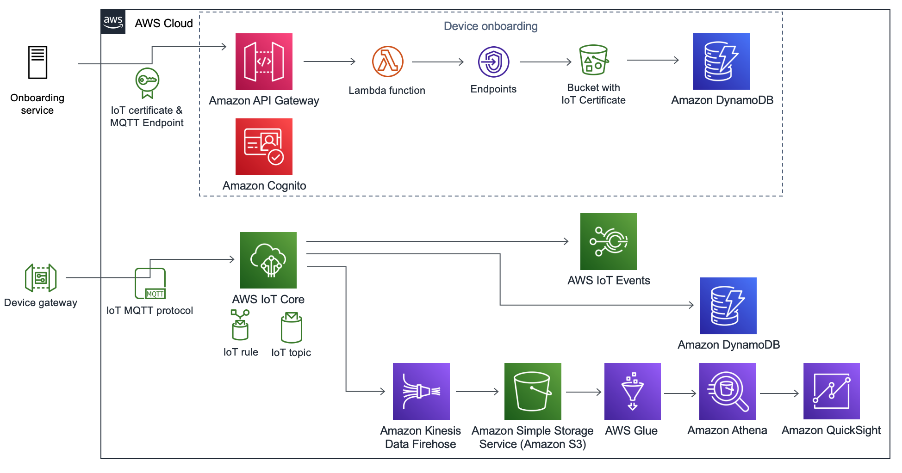

:xrefstyle: short

Deploying this Quick Start into an AWS Region with
default parameters builds the following {partner-product-short-name} environment in the
AWS Cloud.

[#architecture1]
.Quick Start architecture for {partner-product-short-name} on AWS

As shown in <<architecture1>>, the Quick Start sets up a control plane to onboard devices and a data plane to ingest sensors data.

=== Control plane: The device onboarding service:

* IoT Certificate & MQTT Endpoint : The onboarding microservice creates IoT Certificates and returns the MQTT Endpoint to which the device traffic can be sent.
* Amazon API Gateway : The API Gateway exposes 3 endpoint respectively creating, retrieving and deleting onboarded devices.
* Amazon Cognito : Amazon Cognito is used to secure the onboarding microservice. A refresh token is generated upon QuickStart creation allowing users to obtain a session token from Amazon Cognito.
* AWS Lambda Function : The AWS Lambda function runs an executable writtten in Golang used as a backend for creating, retrieving and deleting onboarded devices 
* Amazon S3 Bucket : Created certificates are stored in Amazon S3
* Amazon DynamoDB : Created metadata per onboarded device is stotred in DynamoDB.

=== Data plane: The IoT ingestion layer

* IoT MQTT protocol : Data can be sent using MQTT to the IoT Core MQTT Endpoint returned by the onboarding service.
* AWS IoT Core : AWS Iot Core MQTT Broker securely receives the traffic from authorized devices on the configured MQTT Topic.
** IoT rule : Forward the trafic to both the AWS IoT Sitewise monitor and the IoT Datalake. Additional rules can be added to extend the use of this QuickStart to additional use cases.
** IoT topic : The Iot Topic can be configured form the QuickStart CloudFormation template.
* IOT Sitewise: Data ingested in IOT sitewise can be monitored in real time.
* IoT Datalake: The IoT Datalake ingest cold data for a posteriori monitoring. It is configured by default to display data with a 24 hours freshness. 
** Amazon Kinesis Firehose : Used to ingest the data into Amazon S3.
** Amazon S3 : Stores raw data ingested fomr the sensors along with refined data processed by the ETL script.
** AWS Glue : Hosts the Data catalog, Crawlers and Serverless ETL jobs for the IoT Datalake.
** Amazon Athena : Used to query the sensor data for teh purpose of display in QuickSight dashboards
** Amazon Quicksight : Amazon QuickSight is used to display the sensor data in a preconfigured dashboard. Additional dahsboards can be added.

