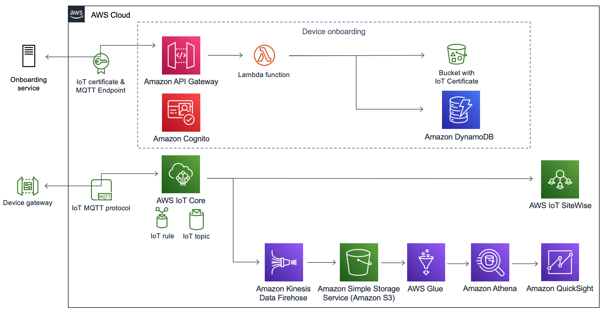

:xrefstyle: short

Deploying this Quick Start into an AWS Region with
default parameters builds the following {partner-product-short-name} environment in the
AWS Cloud.

[#architecture1]
.Quick Start architecture for {partner-product-short-name} on AWS

As shown in <<architecture1>>, the Quick Start sets up a control plane to onboard devices and a data plane to ingest sensors data.

*Control plane: The device onboarding service:*

* the IoT Certificate & MQTT Endpoint is used by the onboarding microservice to create IoT Certificates and return the MQTT Endpoint to which the device traffic can be sent.
* The Amazon API Gateway exposes 3 endpoints respectively; creating, retrieving and deleting onboarded devices.
* Amazon Cognito is used to secure the onboarding microservice. A refresh token is generated upon QuickStart creation allowing users to obtain a session token from Amazon Cognito.
* The AWS Lambda function runs an executable written in Golang used as a backend for creating, retrieving and deleting onboarded devices 
* Created certificates are stored in an Amazon S3 Bucket
* Created metadata per onboarded device is stored in Amazon DynamoDB.

*Data plane: The IoT ingestion layer*

* IoT MQTT protocol : Data can be sent using MQTT to the IoT Core MQTT Endpoint returned by the onboarding service.
* AWS Iot Core MQTT Broker securely receives the traffic from authorized devices on the configured MQTT Topic.
** IoT rule is used to forward the traffic to both the AWS IoT Sitewise monitor and the IoT Datalake. Additional rules can be added 
to extend the use of this QuickStart to additional use cases.
** The Iot Topic can be configured form the QuickStart CloudFormation template.
* Data ingested in IOT sitewise can be monitored in real time.
* The IoT Datalake ingests cold data for posteriori monitoring. It is configured by default to display data within the last 24 hours. 
** Amazon Kinesis Firehose is used to ingest the data into Amazon S3.
** Amazon S3 stores raw data ingested from the sensors along with refined data processed by the ETL script.
** AWS Glue hosts the Data catalog, Crawlers and Serverless ETL jobs for the IoT Datalake.
** Amazon Athena is used to query the sensor data for teh purpose of display in QuickSight dashboards
** Amazon QuickSight is used to display the sensor data in a preconfigured dashboard. Additional dahsboards can be added.

