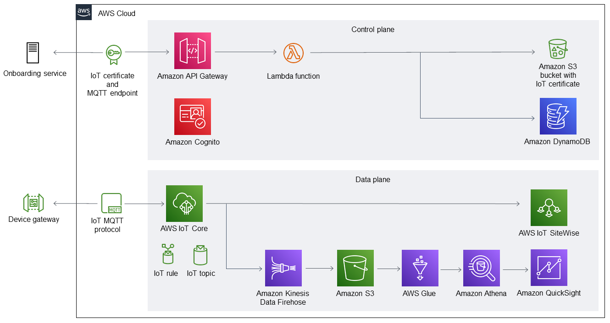

:xrefstyle: short

Deploying this Quick Start into an AWS Region with default parameters builds the following {partner-product-short-name} environment in the AWS Cloud.

[#architecture1]
.Quick Start architecture for {partner-product-short-name} on AWS

As shown in <<architecture1>>, the Quick Start sets up two planes--a control plane to onboard devices and a data plane to ingest sensor data.

For the control plane:

* A serverless microservice for onboarding IoT devices through a REST API call.
* IoT security certificates and MQTT endpoints for the onboarding microservice to use when sending device traffic.
* Amazon API Gateway to expose three REST endpoints for creating, retrieving, and deleting onboarded devices.
* Amazon Cognito to secure the onboarding microservice. The Quick Start generates a refresh token so users can obtain a session token from Amazon Cognito.
* A Lambda function to host a service for creating, retrieving, and deleting onboarded devices. 
* An Amazon S3 bucket to store IoT certificates.
* Amazon DynamoDB to store metadata from onboarded devices.

For the data plane:

* A device gateway to allow the AWS Cloud to ingest traffic from IoT devices.
* An IoT MQTT protocol so data can be sent to the MQTT endpoint from the onboarding microservice. 
* AWS IoT Core, including an MQTT broker that securely receives traffic from authorized devices that are filtered by the IoT topic. AWS IoT Core uses the following resources:

** An IoT rule to forward traffic to both the AWS IoT SiteWise Monitor and the IoT data lake. You can add more rules to extend the Quick Start for other use cases.
** An IoT topic to filter messages. The topic is configured within the AWS CloudFormation template.

* AWS IoT SiteWise to monitor data in real time.
* An IoT data lake to ingest cold data for posteriori monitoring. By default, the data lake is configured to display data from the last 24 hours. 

** Amazon Kinesis Data Firehose to move the data into Amazon S3.
** Amazon S3 to store raw data ingested from the sensors along with refined data processed by the extract, transform, load (ETL) script.
** AWS Glue to host the data catalog, crawlers, and serverless ETL jobs for the IoT data lake.
** Amazon Athena to query the sensor data for display in dashboards.
** Amazon QuickSight to display the sensor data in a preconfigured dashboard. You can configure additional dashboards if desired. 

